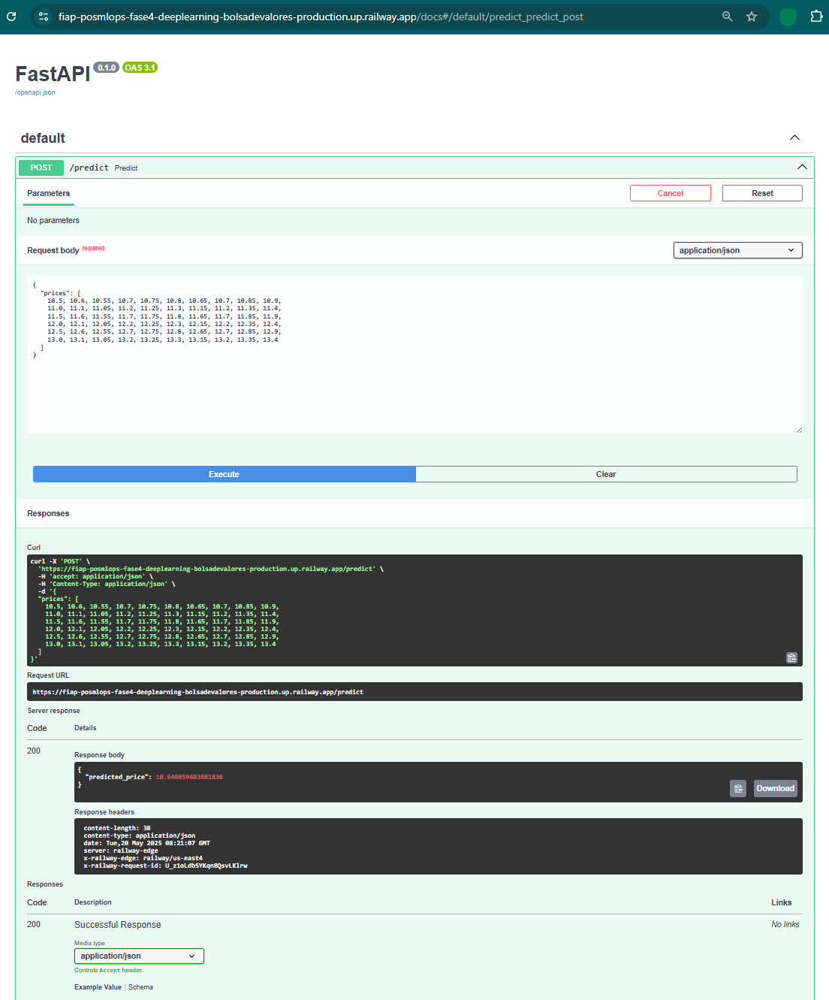

# 📈 Previsão de Preços de Ações com LSTM  
Tech Challenge | Fase 4 — Residência em Ciência de Dados  

## 🧠 Visão Geral  
Este projeto visa a construção de um pipeline completo para previsão de preços de ações utilizando Redes Neurais Recorrentes (RNN), especificamente o modelo LSTM (Long Short-Term Memory). A aplicação é capaz de coletar dados financeiros, pré-processá-los, treinar um modelo preditivo, avaliá-lo e disponibilizar previsões por meio de uma API REST.

---

## 🚀 Tecnologias Utilizadas
- **Linguagem**: Python 3.10+
- **Frameworks & Bibliotecas**:
  - `pandas`, `numpy`, `scikit-learn`, `tensorflow`, `alpha vantage`
  - `matplotlib`, `seaborn`
  - `FastAPI`, `Uvicorn`
- **Deploy & Containers**: Docker (suporte futuro)

---

## 📁 Estrutura de Pastas

```
fiap-posmlops-fase4-deeplearning
│
├── .github/
│   ├── workflows
│       ├── pipeline.yaml                 # Pipeline do projeto
│
├── data/                                 # Dados brutos e pré-processados
│   ├── raw_stock_data.csv
│   └── processed_data.npz
│
├── metrics/                              # Relatórios de avaliação
│   └── metric_report.html
│
├── models/                               # Modelos treinados
│   └── lstm_model.keras
│
├── src/                                  # Módulos do projeto
│   ├── api.py
│   ├── data_collection.py
│   ├── data_preprocessing.py
│   ├── metric_report.py
│   ├── model_training.py
│   └── model_evaluation.py
│
├── main.py                               # Script principal
├── requirements.txt                      # Bibliotecas de instalação
├── Dockerfile                            # Container de execução
├── .gitignore                            # Arquivo e pastas ignorados pelo git
├── README.md                             # Este arquivo
└── Documentacao_DeepLearning_Fase4.pdf   # Documentação do Projeto LSTM
```

---

## ⚙️ Funcionalidades

| Modo        | Descrição                                                                 |
|-------------|--------------------------------------------------------------------------|
| `collect`   | Coleta dados históricos de ações com `yfinance`.                         |
| `preprocess`| Normaliza e estrutura os dados para entrada no modelo LSTM.              |
| `train`     | Treina um modelo LSTM com os dados processados.                          |
| `evaluate`  | Avalia o modelo e gera métricas como MAE, RMSE e MAPE (CSV + HTML).      |
| `api`       | Inicia um servidor FastAPI para servir o modelo.                         |
| `all`       | Executa todos os passos acima em sequência.                              |

---

## ▶️ Como Executar

### 1. Clonar o Repositório
```bash
git clone https://github.com/seuusuario/tech-challenge-lstm.git
cd tech-challenge-lstm
```

### 2. Criar Ambiente Virtual (opcional)
```bash
python -m venv venv
source venv/bin/activate  # Linux/macOS
venv\Scripts\activate     # Windows
```

### 3. Instalar Dependências
```bash
pip install -r requirements.txt
```

### 4. Executar o Pipeline Completo
```bash
python main.py --mode all --ticker AAPL --start_date 2020-01-01 --end_date 2025-05-01
```

### 5. Iniciar a API
```bash
python main.py --mode api
```

Acesse Local: `http://127.0.0.1:8000/docs` para usar a interface Swagger da API.

Acesse Produção: https://fiap-posmlops-fase4-deeplearning-bolsadevalores-production.up.railway.app/docs

---

### 6. Payload com 60 valores de preços
```
{
  "prices": [
    10.5, 10.6, 10.55, 10.7, 10.75, 10.8, 10.65, 10.7, 10.85, 10.9,
    11.0, 11.1, 11.05, 11.2, 11.25, 11.3, 11.15, 11.2, 11.35, 11.4,
    11.5, 11.6, 11.55, 11.7, 11.75, 11.8, 11.65, 11.7, 11.85, 11.9,
    12.0, 12.1, 12.05, 12.2, 12.25, 12.3, 12.15, 12.2, 12.35, 12.4,
    12.5, 12.6, 12.55, 12.7, 12.75, 12.8, 12.65, 12.7, 12.85, 12.9,
    13.0, 13.1, 13.05, 13.2, 13.25, 13.3, 13.15, 13.2, 13.35, 13.4
  ]
}

```

### 7. Clique aqui para ver a evidência em Produção 👉 


## 📊 Relatório de Métricas  
Um relatório em HTML será gerado automaticamente em `metrics/metric_report.html`, contendo:

- **MAE (Erro Absoluto Médio)**
- **RMSE (Raiz do Erro Quadrático Médio)**
- **MAPE (Erro Percentual Absoluto Médio)**

---

## 👨‍💻 Autor
**Alexandro de Paula Barros**  
FIAP: Pós-Graduação
Curso: Machine Learning Engineering

---
